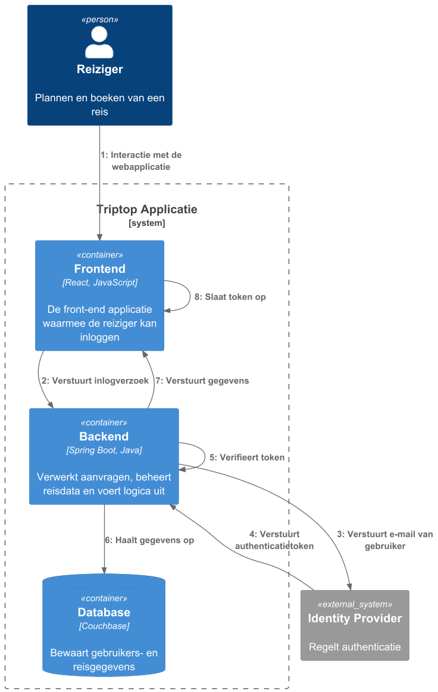
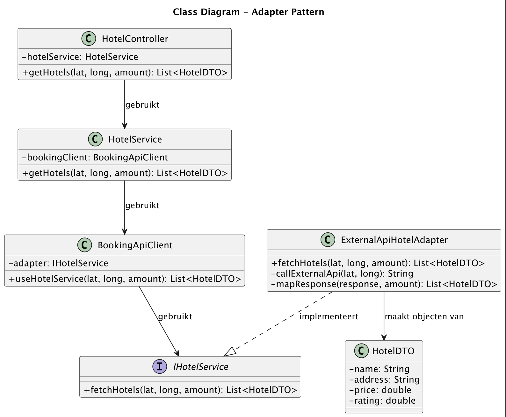
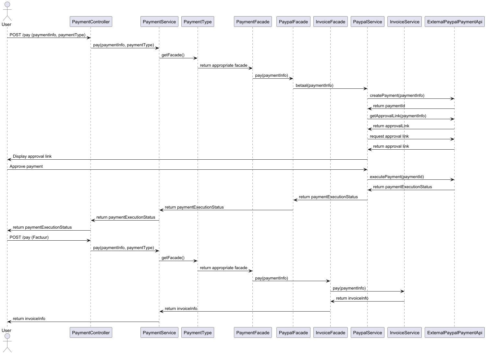
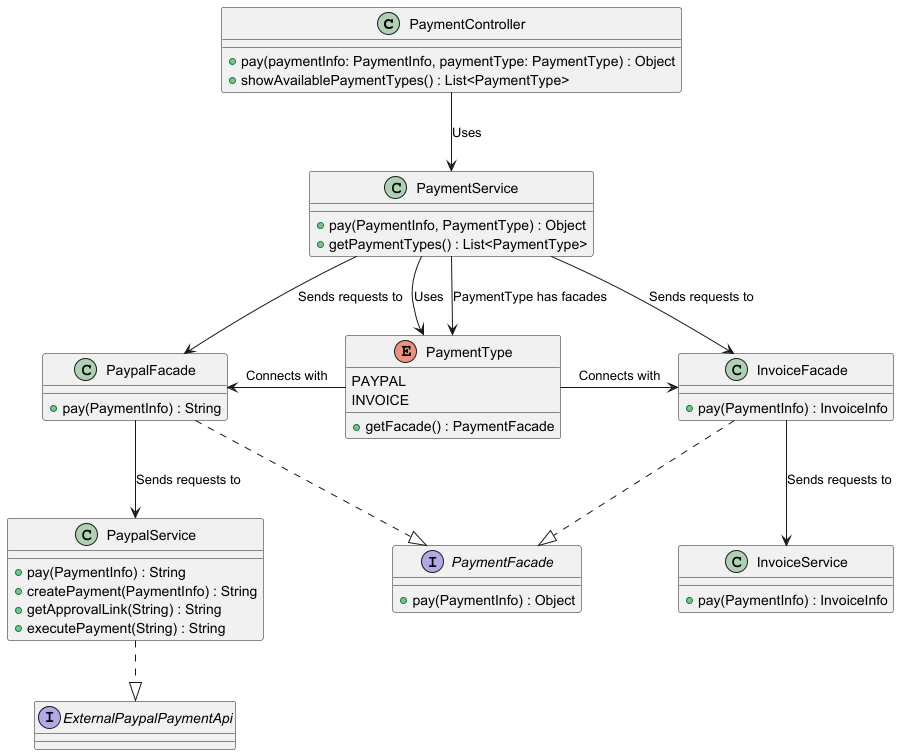

# Software Guidebook Triptop

## 1. Introduction
Dit software guidebook geeft een overzicht van de Triptop-applicatie. Het bevat een samenvatting van het volgende: 
1. De vereisten, beperkingen en principes. 
1. De software-architectuur, met inbegrip van de technologiekeuzes op hoog niveau en de structuur van de software. 
1. De ontwerp- en codebeslissingen die zijn genomen om de software te realiseren.
1. De architectuur van de infrastructuur en hoe de software kan worden geinstalleerd. 

## 2. Context

**Functionaliteit**

TripTop is een webapplicatie die reizigers ondersteunt bij het plannen, boeken en beheren van reizen. De applicatie biedt een centrale interface waarmee gebruikers accommodaties, transport, activiteiten, autoverhuur en eetgelegenheden kunnen reserveren via integraties met externe systemen. Daarnaast biedt TripTop authenticatie via bekende loginproviders en ondersteuning voor reisagenten die reizigers helpen bij boekingen en wijzigingen.

**Gebruikers**
- **Reizigers**: Dit zijn de primaire gebruikers van TripTop. Zij kunnen via de webapplicatie hun reizen plannen, accommodaties en vervoer boeken, activiteiten toevoegen en restaurants reserveren.
- **Reisagenten**: Ondersteunen reizigers bij het boeken en beheren van reizen. Zij hebben toegang tot de boekingsfunctionaliteiten en kunnen in opdracht van de reiziger wijzigingen aanbrengen.

**Externe Systemen**
TripTop communiceert met verschillende externe systemen om reisgerelateerde diensten aan te bieden:
- **Booking.com / Airbnb API**: Voor het boeken van accommodaties.
- **NS / Deutsche Bahn / KLM API**: Voor het reserveren van trein- en vliegreizen.
- **Sixt / Hertz API**: Voor het huren van auto’s.
- **Tripadvisor / GetYourGuide API**: Voor het boeken van activiteiten en excursies.
- **Takeaway / Eet.nu API**: Voor het bestellen van eten en maken van restaurantreserveringen.
- **Google / Microsoft / Airbnb loginprovider**: Voor gebruikersauthenticatie en login.
- **PayPal API**: Voor het verwerken van betalingen.

## 3. Functional Overview

Om de belangrijkste features toe te lichten zijn er user stories en twee domain stories gemaakt en een overzicht van het domein in de vorm van een domeinmodel. Op deze plek staat typisch een user story map maar die ontbreekt in dit voorbeeld.

### 3.1 User Stories

#### 3.1.1 User Story 1: Reis plannen

Als gebruiker wil ik een zelfstandig op basis van diverse variabelen (bouwstenen) een reis kunnen plannen op basis van mijn reisvoorkeuren (wel/niet duurzaam reizen, budget/prijsklasse, 's nachts reizen of overdag etc.) zodat ik op vakantie kan gaan zonder dat hiervoor een reisbureau benodigd is.

#### 3.1.2 User Story 2: Reis boeken

Als gebruiker wil ik een geplande reis als geheel of per variabele (bouwsteen) boeken en betalen zodat ik op vakantie kan gaan zonder dat hiervoor een reisbureau benodigd is.

#### 3.1.3 User Story 3: Reis cancelen

Als gebruiker wil ik een geboekte reis, of delen daarvan, kunnen annuleren zodat ik mijn geld terug kan krijgen zonder inmenging van een intermediair zoals een reisbureau.

#### 3.1.4 User Story 4: Reisstatus bewaren 

Als gebruiker wil ik mijn reisstatus kunnen bewaren zonder dat ik een extra account hoef aan te maken zodat ik mijn reis kan volgen zonder dat ik daarvoor extra handelingen moet verrichten.

#### 3.1.5 User Story 5: Bouwstenen flexibel uitbreiden

Als gebruiker wil ik de bouwstenen van mijn reis flexibel kunnen uitbreiden met een zelf te managen stap (bijv. met providers die niet standaard worden aangeboden zoals een andere reisorganisatie, hotelketen etc.) zodat ik mijn reis helemaal kan aanpassen aan mijn wensen.

### 3.2 Domain Story Reis Boeken (AS IS)

### 3.3 Domain Story Reis Boeken (TO BE)

### 3.4 Domain Model

Binnen TripTop wordt data op verschillende manieren verwerkt en uitgewisseld tussen de applicatie, externe API's en de eindgebruiker. Sommige gegevens worden direct door de gebruiker ingevoerd, terwijl andere worden opgehaald uit externe systemen of doorgegeven aan API’s voor verdere verwerking. De onderstaande tabel geeft een overzicht van hoe belangrijke gegevensattributen binnen het systeem stromen, welke API’s erbij betrokken zijn en of deze gegevens in de applicatie moeten worden opgeslagen.

| Class::attribuut        | Is input voor API+Endpoint                | Wordt gevuld door API+Eindpoint | Wordt geleverd door eindgebruiker | Moet worden opgeslagen in de applicatie |
| ----------------------- | ----------------------------------------- | ------------------------------- | :-------------------------------: | :-------------------------------------: |
| Trip                    | JSON Saver (POST)                         |                                 |                 x                 |                    x                    |
| TriptopGebruiker::email | Easy Authenticator (POST)                 |                                 |                 x                 |                    x                    |
| TriptopGebruiker::email | Sending an email   /send-email (POST) |                                 |                 x                 |                    x                    |
| Email::content          | Sending an email   /send-email (POST) | x                               |                                   |                                         |
| Email::subject          | Sending an email   /send-email (POST) | x                               |                                   |                                         |

## 4. Quality Attributes

Voordat deze casusomschrijving tot stand kwam, heeft de opdrachtgever de volgende ISO 25010 kwaliteitsattributen benoemd als belangrijk:
* Compatibility -> Interoperability (Degree to which a system, product or component can exchange information with other products and mutually use the information that has been exchanged)
* Reliability -> Fault Tolerance (Degree to which a system or component operates as intended despite the presence of hardware or software faults)
* Maintainability -> Modularity (Degree to which a system or computer program is composed of discrete components such that a change to one component has minimal impact on other components)
* Maintainability -> Modifiability (Degree to which a product or system can be effectively and efficiently modified without introducing defects or degrading existing product quality)
* Security -> Integrity (Degree to which a system, product or component ensures that the state of its system and data are protected from unauthorized modification or deletion either by malicious action or computer error)
* Security -> Confidentiality (Degree to which a system, product or component ensures that data are accessible only to those authorized to have access)

## 5. Constraints

De software wordt opgesteld voor een webapplicatie, en zal dus nog geen rekening houden met een mobiele- of desktop applicatie . 
Communicatie met externe APIs wordt uitgevoerd door gebruik van JSON.
De frontend zal worden opgesteld door gebruik van Javascript en React. De backend wordt gemaakt door gebruik van Java en Spring Boot.
Deze keuze is gemaakt omdat het projectteam al bekend is met deze talen en frameworks, en er al andere onbekende onderdelen worden gebruikt waarmee het team zich bekend moet maken.

## 6. Principles

**Single Responsibility Principle (SRP)**

Elke module binnen het systeem heeft één duidelijke verantwoordelijkheid. Dit maakt de code overzichtelijk, onderhoudbaar en makkelijker te testen.
Functionaliteit zoals gebruikersbeheer, betalingen of communicatie met externe services is telkens gescheiden.
**Open-Closed Principle (OCP)**
De architectuur is opgebouwd rond afhankelijkheid van abstracties (zoals interfaces), niet van concrete implementaties.
Hierdoor blijft de structuur flexibel en losgekoppeld: onderdelen kunnen onafhankelijk vervangen of aangepast worden.

**Dependency Inversion Principle (DIP)**
De architectuur is opgebouwd rond afhankelijkheid van abstracties (zoals interfaces), niet van concrete implementaties. 
Hierdoor blijft de structuur flexibel en losgekoppeld: onderdelen kunnen onafhankelijk vervangen of aangepast worden.

**Program to an Interface**
Modules communiceren via abstracties in plaats van directe implementaties. 
Dit zorgt ervoor dat ze uitwisselbaar blijven en los staan van specifieke technologieën of externe services.

#### Encapsulate what varies
Binnen de software wordt er regelmatig gebruik gemaakt van verschillende soorten reis data en activiteiten waarmee de gebruikers hun reis kunnen samen stellen. 
Deze stukken reis data kunnen zich binnen het systeem in verschillende toestanden bevinden, met elke toestand ander gedrag en variabele die moeten worden opgeslagen. 
Omdat deze toestanden later nog aangepast of uitgebreid kunnen worden is het volgens het design principe 'Encapsulate What Varies' van belang dat deze toestanden worden opgenomen 
in een geïsoleerde omgeving van de rest van de software door gebruik van een interface die bij alle toestanden geïmplemteerd word.
Verder wordt elke externe datastructuur ingekapseld in een aparte adapter, waardoor wijzigingen in de datastructuur van een externe service geen impact hebben op de rest van het systeem.
De logica van het fetchen en mappen van de externe data is volledig losgekoppeld van de rest van de applicatie.

#### Interface Segregation Principle(ISP)
Het Interface Segregation Principle (ISP) is een van de SOLID-principes en stelt dat een interface niet verplicht mag worden om methoden te implementeren die het niet nodig heeft.
Dit zorgt ervoor dat klassen alleen afhankelijk zijn van methoden die ze daadwerkelijk gebruiken.

## 7. Software Architecture

### 7.1. Containers

**Statisch container diagram**

Dit containerdiagram geeft een overzicht van het TripTop systeem en zijn interacties. Reizigers plannen en beheren hun reizen via de Frontend (React), terwijl reisagenten hen ondersteunen. De Backend (Spring Boot) verwerkt alle aanvragen en beheert de communicatie met externe systemen.

Authenticatie verloopt via Google, Microsoft en Airbnb Login API's, en betalingen worden afgehandeld met iDEAL. De backend regelt ook boekingen bij Booking.com, NS, KLM, Sixt, Tripadvisor, Takeaway en andere externe diensten. Gegevens worden opgeslagen in een Couchbase-database.

Dankzij deze opzet fungeert de backend als centrale schakel, waardoor de frontend soepel met zowel gebruikers als externe systemen kan communiceren.

**Dynamisch diagram bij user story 'inloggen':**

**Dynamisch C4 diagram 'reis boeken':**

### 7.2. Components

#### 7.2.1. Component diagram

**Algemeen component diagram**

**Component diagram: Adapter pattern (Cas)**

Dit diagram geeft een overzicht van de authenticatie- en gebruikersbeheercomponenten binnen de **TripTop Backend**.
- **Frontend** (React) communiceert met de backend via **UserController** voor gebruikersbeheer en authenticatie.
- **UserController** verwerkt gebruikersaanvragen en stuurt deze door naar **UserService**, die de gebruikerslogica beheert.
- **UserService** slaat gebruikersgegevens op en haalt ze op via **UserRepository**, die communiceert met de **Couchbase Database**.
- Voor authenticatie gebruikt **UserService** de **iAuthProviderAdapter**, een adapter die externe authenticatieproviders ondersteunt.
- De **iAuthProviderAdapter** kan verschillende externe authenticatieservices aanspreken, zoals de **Google Login API** en **Microsoft Login API**, om gebruikers veilig te authenticeren.
Dit ontwerp maakt gebruik van het **Adapter Pattern**, waardoor eenvoudig nieuwe authenticatieproviders kunnen worden toegevoegd zonder wijzigingen aan **UserService**.

**Dynamisch diagram: Adapter pattern (Cas)**

In dit dynamisch componentdiagram wordt de interactie tussen de verschillende systeemcomponenten binnen de TripTop applicatie voor gebruikersauthenticatie weergegeven. Het diagram toont de communicatie van een authenticatieverzoek van de gebruiker via de AuthController naar de AuthService, die vervolgens de MicrosoftAuthAdapter gebruikt om te communiceren met de ExternalAPI voor het verifiëren van de gebruiker. Na ontvangst van de respons wordt de gegevens gemapt naar het interne domeinmodel en opgeslagen in de Database via de AuthRepository. Ten slotte wordt het resultaat van de authenticatie teruggestuurd naar de AuthController om de gebruiker te informeren over het succes of falen van het proces.

#### Component Diagram beschermen tegen externe API's

Aan de achterkant zorgt de HotelService ervoor dat de logica wordt afgehandeld. Deze service schakelt de BookingApiClient in, die via de interface IHotelService communiceert met een adapter (ExternalApiHotelAdapter).

De adapter maakt een HTTP-aanroep naar de externe Booking.com API en zet de response om naar een interne representatie (HotelDTO). Deze losgekoppelde structuur voorkomt dat wijzigingen in de externe API impact hebben op de rest van de applicatie.
#### Dynamic Diagram beschermen tegen externe API's

Dit diagram toont de flow van een hotelzoekopdracht in de applicatie.
1.	De gebruiker stuurt een HTTP GET-verzoek naar /hotels.
2.	De HotelController stuurt de parameters door naar de HotelService.
3.	De HotelService schakelt de BookingApiClient in voor communicatie met de adapter.
4.	De BookingApiClient gebruikt de ExternalApiHotelAdapter om een API-aanroep te doen naar Booking.com.
5.	De adapter haalt de externe JSON-response op en zet deze om naar een interne HotelDTO.
6.	De lijst van HotelDTO’s wordt via de lagen teruggestuurd naar de gebruiker als JSON.

#### Component Diagram States

Bovenstaand diagram toont de verschillende componenten die spelen bij het aanpassen en opslaan van een stuk reisdata. 
Hierbij wordt de reisdata eerst opgehaald vanuit de database of vanuit de externe APIs waarmee andere onderdelen van de applicatie in contact staan.

#### Dynamic Diagram States

Bovenstaand diagram toont de manier waarop verschillende componenten met elkaar communiceren om de toestand van een stuk reisdata of activiteit aan te passen. 
Belangrijk aan deze volgorde is dat niet alle states zo maar mogen worden aangepast, wat de reden is voor het updaten van de state binnen de service. 
Hier wordt gecontroleerd welke state de reisdata zich nu in bevindt, wat dus ook bepaald naar welke states die wel of niet mag transitioneren.

#### Component Diagram meerdere betaalmethodes

Bovenstaand diagram toont de verschillende componenten om de verschillende betaalmethoden aan te roepen.

###     7.3. Design & Code

**Class diagram: Adapter pattern (Authenticatie)**

Authenticatie binnen TripTop wordt afgehandeld via een gestructureerde laag van controllers, services en adapters. De AuthenticationController ontvangt verzoeken van de frontend en roept de AuthenticationService aan voor verdere verwerking. Deze service beheert gebruikersauthenticatie, waaronder het genereren en verifiëren van authenticatiesleutels.

Om flexibiliteit te garanderen, maakt de applicatie gebruik van het Adapter Pattern. De AuthProviderAdapter fungeert als een abstracte interface voor externe authenticatiediensten, zoals Microsoft en Google. Hierdoor kan de applicatie eenvoudig uitbreiden met extra providers zonder wijzigingen in de kernlogica. Het onderstaande diagram toont de interacties tussen deze componenten.

In het adapter pattern dat ik heb toegepast, zorgt de MicrosoftAuthAdapter ervoor dat AuthService kan communiceren met de ExternalAPI zonder afhankelijk te zijn van de specifieke implementatie van die API. AuthService roept de adapter aan via de interface iAuthProviderAdapter, waardoor het mogelijk is om eenvoudig andere authenticatieproviders toe te voegen, zoals een GoogleAuthAdapter. Dit ontwerp volgt design principles zoals Single Responsibility, Open-Closed, Dependency Inversion, Encapsulate What Varies en Program to an Interface, wat de flexibiliteit en onderhoudbaarheid van de applicatie vergroot.

Zie ADR 8.9, hierin wordt uitgelegd waarom het adapter pattern is toegepast.

**Single Responsibility Principle (SRP)**

De MicrosoftAuthAdapter heeft als enige verantwoordelijkheid het aanpassen van de interface van de ExternalAPI naar de interface die AuthService verwacht. Dit zorgt ervoor dat AuthController, AuthService en ExternalAPI hun eigen verantwoordelijkheden behouden zonder dat ze afhankelijk zijn van aanpassingen in de adapter.

**Open-Closed Principle (OCP)**

Het Adapter Pattern respecteert het Open-Closed Principle doordat we nieuwe adapters kunnen toevoegen (zoals GoogleAuthAdapter in de toekomst) zonder AuthService te wijzigen. AuthService blijft werken zonder aanpassingen, ongeacht welke externe authenticatieservice wordt gebruikt.

**Dependency Inversion Principle (DIP)**

De AuthService is niet direct afhankelijk van de MicrosoftAuthAdapter, maar van de interface iAuthProviderAdapter. Hierdoor kan AuthService werken met verschillende implementaties zonder afhankelijk te zijn van een specifieke externe authenticatiedienst. Dit maakt het systeem flexibeler en uitbreidbaar.

**Encapsulate What Varies**

De variabiliteit in authenticatieproviders wordt verborgen achter de iAuthProviderAdapter interface. Hierdoor hoeft AuthService geen wijzigingen te ondergaan wanneer een nieuwe authenticatieprovider, zoals GoogleAuthAdapter, wordt toegevoegd. De implementatiedetails van de specifieke adapters blijven geïsoleerd binnen hun respectieve klassen, waardoor de rest van het systeem hier geen last van heeft.

**Program to an Interface**

De AuthService werkt met iAuthProviderAdapter in plaats van met een specifieke implementatie zoals MicrosoftAuthAdapter. Dit betekent dat het systeem niet afhankelijk is van concrete klassen, maar van abstracties. Hierdoor kunnen nieuwe adapters eenvoudig worden toegevoegd zonder impact op de bestaande code.

**Sequence diagram: Adapter pattern (Authenticatie)**

Het authenticatieproces binnen TripTop verloopt via een gelaagde structuur waarin de AuthController aanvragen van de frontend verwerkt en deze doorstuurt naar de **AuthService**. Deze service bepaalt welke externe authenticatieprovider moet worden aangesproken en gebruikt de juiste adapter, zoals de MicrosoftAuthAdapter, om een verzoek naar de externe API te sturen.

Na verificatie ontvangt de adapter een reactie van de externe dienst en zet deze om naar een domeinmodel dat de applicatie begrijpt. Vervolgens slaat de AuthService de gebruikersgegevens op via de AuthRepository, die deze data in de database vastlegt. Uiteindelijk keert de verwerkte authenticatierespons terug naar de controller, die deze doorstuurt naar de client. Het onderstaande sequence diagram toont dit proces stap voor stap.

---

**Adapter Pattern Sequence Diagram**

Het sequentiediagram toont de volledige flow van een HTTP-aanvraag tot aan de gemapte hoteldata. De HotelController handelt de HTTP GET request af en gebruikt de HotelService voor domeinlogica. Die service schakelt via de BookingApiClient de ExternalApiHotelAdapter in.
De adapter zorgt voor communicatie met de Booking.com API (callExternalApi) en zet de response om naar een bruikbare datastructuur (mapResponse).
De mapping gebeurt binnen de adapter zelf, wat past bij het Single Responsibility Principle en het Adapter Pattern.

**Adapter Pattern Class Diagram**

In De verantwoordelijkheden zijn duidelijk verdeeld over de verschillende klassen van de applicatie:
• De HotelController is enkel verantwoordelijk voor het afhandelen van HTTP-verzoeken.

• De HotelService bevat de businesslogica en bepaalt welke API-client wordt aangesproken.

• De BookingApiClient fungeert als delegatielaag tussen service en adapter.

• De ExternalApiHotelAdapter is verantwoordelijk voor het ophalen én mappen van de externe response naar het interne formaat.
Travel data states class diagram. 
=======
**Travel data states class diagram**

In bovenstaand diagram is weergegeven welke classes van belang zijn voor het beheren van de toestand van een stuk reisdata. 
Binnen dit diagram staat het interface 'TravelDataState' centraal met een abstracte methode die in elke toestand klasse word geïmplementeerd. 
Op het moment dat de toestand van een 'TravelData' object is aangepast word daarmee ook de implementatie van de 'updateState' methode aangepast, 
hierdoor veranderd het gedrag van het object waardoor de state design pattern word toegepast zoals beschreven in ADR-005 Reisdata toestand. 
Op deze manier wordt er ook rekening gehouden met het design principe 'Encapsulate What Varies', zoals besproken in hoofdstuk 6.

**Travel Data State Pattern state diagram**

In bovenstaand diagram is weergegeven op welke manier de toestand van een stuk reisdata kan veranderen. 
Er word hierbij vanuit gegaan dat de toestanden 'Arranged' en 'Paid' aan elkaar gelijk staan, omdat niet alle activiteiten altijd vooraf betaald hoeven worden. 
Denk hierbij bijvoorbeeld aan een etentje of iets soortgelijks wat ter plekke betaald word maar wel gereserveerd kan worden.
Zodra een stuk reisdata op 'done' staat kan deze niet meer worden aangepast.

Sequence diagram meerdere betaalmethodes

Class diagram meerdere betaalmethodes

[ADR Design](#87-adr-007-meerdere-betaalsystemen)

[ADR Design pattern](#88-adr-008-Design-pattern-meerdere-betaalsystemen)

Dit betaalsysteem maakt gebruik van het Facade Pattern, Adapter Pattern.
Ook maakt het gebruik van het design principe Interface Segregation Principle.

Het maakt gebruik van Facade door de complexiteit van de betaalservices te verbergen achter eenvoudige facades (PaypalFacade en InvoiceFacade).
Deze roepen de bijbehorende services aan waar alle complexe code wordt verwerkt. Het enige wat je hoeft te doen is pay() aan te roepen met de juiste PaymentType.
Het maakt gebruik van Adapter door PaypalService in te zetten als een adapter voor een externe PayPal API. De PayPal-service vertaalt externe API-aanroepen naar een consistente interface met methoden zoals createPayment(), getApprovalLink() en executePayment().
Hierdoor kan PaymentService eenvoudig met PayPal-betalingen omgaan, zonder afhankelijk te zijn van de externe API-structuur.

Tot slot zorgt ISP ervoor dat interfaces klein en specifiek blijven. PaymentFacade bevat alleen de methode pay(PaymentInfo), zodat PaypalFacade en InvoiceFacade geen onnodige methoden hoeven te implementeren.
Ook bevatten PaypalService en InvoiceService alleen functionaliteit die relevant is voor hun betaalmethode.

## 8. Architectural Decision Records

# 8.1. ADR-001 Keuze voor welke database
## Status
Accepted
## Context

Voor TripTop, een Reisplanningsapplicatie
in constructie, moeten we een database kiezen
die schaalbaar en flexibel is, gezien de
verschillende bouwstenen en de integratie
met externe services. De database moet in staat zijn om dynamisch gegevens op te slaan,
zoals reisopties en gebruikersinformatie, en deze efficiënt beheren.
De keuze moet ook de integratie van diverse APIs en het omgaan met veranderende datastructuren ondersteunen,
zonder de applicatie ingrijpend aan te passen.

## Considered Options

| Forces | MongoDB | Cassandra | neo4J | Redis | Couchbase | MySQL |
| --- |---| - |-------|-------|-----------|-------|
| snelheid | + | + | +     | +     | +         | 0     |
| leercurve | + | — | —     | +     | +         | ++    |
| functionaliteit | ++ | + | +     | -     | ++        | ++    |
| schaalbaarheid | + | + | +     | +     | 0         | 0     |
| ervaring | 0 | 0 | 0     | —     | —         | ++    |

## Decision

Omdat functionaliteit en leercurve zwaar meewegen, en ervaring,
schaalbaarheid & snelheid minder meeweegt, is bij ons de overweging gekomen tussen MySQL, MongoDB & Couchbase.
De keuze is gevallen op Couchbase, omdat deze de meeste voordelen heeft.
Als we kijken naar de tabel, en alle zwaarwegende plussen en minnen op- en aftellen,
dan komen wij tot de conclusie dat Couchbase het hoogst scoort.

## Consequences

Het gebruiken van Couchbase geeft TripTop de mogelijkheid om flink op te schalen wanneer het bedrijf daar klaar voor is.
Je krijgt documentbased data, waardoor het datamodel enorm flexibel is.
Het wordt dus makkelijk gemaakt om snel data toe te voegen, of bestaande structuren aan te passen wanneer nodig.
Ook is Couchbase makkelijker te leren

# 8.2. ADR-002 design pattern beschermen tegen externe API's
## Status
Accepted
## Context
De applicatie TripTop communiceert met verschillende externe API’s (Booking.com, Sixt, NS, TripAdvisor, etc). Deze API’s hebben allemaal hun eigen datastructuur, die ook nog eens zouden kunnen veranderen. Een wijziging in hun structuur kan direct impact hebben op de werking van TripTop.

Mijn ontwerpvraag is: “Hoe zorg je ervoor dat je bij een wijziging in de datastructuur van een externe service niet de hele applicatie hoeft aan te passen?”

## Considered Options

| Forces            | Adapter | Facade | State | Strategy | Factory | 
|-------------------|---------|--------|-------|----------|---------|
| Onderhoudbaarheid | ++      | ++     | -     | ++       | ++      |
| Testbaarheid      | +       | -      | --    | ++       | -       |
| Flexibiliteit     | ++      | 0      | -     | +        | 0       |

## Decision
Na het evalueren van verschillende design patterns is gekozen voor het Adapter Pattern. Dit biedt de beste balans tussen onderhoudbaarheid, flexibiliteit en testbaarheid, terwijl dit pattern het  eenvoudig maakt om nieuwe externe services toe te voegen zonder de interne logica te verstoren.

## Consequences
Het gebruik van het Adapter Pattern maakt de code flexibel voor toekomstige uitbreidingen en vergemakkelijkt de testbaarheid door het mocken van externe services. Het zorgt ervoor dat de backend-architectuur robuust blijft, zelfs als de externe systemen veranderen of nieuwe systemen moeten worden geïntegreerd.

# 8.3. ADR-003 Oplossingen voor beschermen tegen externe API's

## Context

In de applicatie TripTop communiceren we met meerdere externe services (zoals autoverhuur, hotels, activiteiten, vervoer en eetopties). Deze services leveren data met eigen, vaak veranderlijke datastructuren. Een wijziging in een response van zo’n externe service kan impact hebben op meerdere onderdelen van de applicatie.

Zoals in de vorige ADR aangegeven, is het Adapter Pattern gekozen om deze afhankelijkheid te isoleren.
Nu gaan we onderzoeken of er geen andere, patternvrije oplossingen zijn, die misschien beter passen.

## Considered Options

| Criteria | directe parsing van JSON in de services | Externe API Adapter/APiMapper | één centrale ApiGateway |
| --- | --- | --- | --- |
| snelheid (van verwerken data) | ++ | + | +/- |
| schaalbaarheid | ++ | + | — |
| Aanpasbaarheid | — | ++ | - |

## Decision

De keuze is gevallen op het Adapter Pattern.

De adapter pattern was verreweg de beste keuze op basis van het onderzoek wat ik gedaan heb. De andere opties hadden geen directe goede oplossingen voor isolatie van afhankelijkheid, en de aanpasbaarheid was ook minder sterk.
Deze criteria wogen het zwaarst voor deze beslissing.

## Consequences

•	Wijzigingen in externe datastructuren vereisen alleen aanpassing in de betreffende client/mapper

•	De rest van de applicatie (services, controller, repository) blijft stabiel

•	We kunnen eenvoudig nieuwe externe APIs integreren door nieuwe client + mapping toe te voegen

•	Door duidelijk onderscheid tussen domeinmodellen en externe modellen, blijft code begrijpelijk en testbaar

# 8.4. ADR-004 API Falen 

## Status
Rejected

## Context

Voor TripTop, een Reisplanningsapplicatie in constructie,
worden verschillende externe APIs aangeroepen voor het ophalen van reisinformatie voor gebruikers. 
Echter komt het wel eens voor dat de externe APIS onbeschikbaar zijn waardoor deze informatie onbeschikbaar is.
Daarom moet er een keuze gemaakt worden in hoe het systeem hierop reageert.

## Considered Options

| Criteria / Forces  | In-Memory Cache | Foutmelding | Couchbase Cache | Redis | 
|--------------------|----------------|-------------|-----------------|-------|
| Snelheid           | +              | ++          | +               | +     |
| Leercurve          | 0              | ++          | 0               | -     | 
| Waardevolle output | +              | --          | ++              | ++    |
| integreerbaar      | +              | ++          | ++              | 0     |

## Decision

Ondanks dat een simpele foutmelding het meeste pluspunten scoort, valt deze optie al snel af omdat de voornaamste eis de waardevolle output is. 
Omdat er gebruikt word gemaakt van CouchBase als database is het gebruik van de cache binnen deze database makkelijk te integreren, en dus de uiteindelijke keuze. 
Echter is de database voor geen andere ontwerpvraag van belang, en is dus nog niet geïmplemteerd waardoor dat ook zou moeten gebeuren voor het opstellen van de cache.
Met deze redenering is het voorstel afgewezen ten gunste van een andere ontwerpvraag.

## Consequences

Door het voorstel af te wijzen komen er momenteel geen nuttige resultaten als een API faalt om informatie terug te geven.

# 8.5. ADR-005 Reisdata toestand

## Status
Accepted

## Context

Voor TripTop, een Reisplanningsapplicatie in constructie,
worden verschillende stukken reisdata opgehaald en opgeslagen voor het organiseren van een of meerdere reisen. 
Deze stukken reisdata bevatten informatie zoals overnachtingen, vervoer, autohuur, excursies, etc. 
Deze reisdata word opgeslagen met gebruik van verschillende toestanden zodat de gebruiker bij kan houden hoe zijn/haar reisplanning verloopt. 
De vraag is hoe deze toestanden het best kunnen worden geïmplementeerd.

## Considered Options

| Criteria / Forces             | State Pattern | Enum | Strategy Pattern | 
|-------------------------------|--------------|------|------------------|
| Staat verschillend gedrag toe | ++           | +    | +                |
|Uitbreidbaar | + | ++   | + |   
| Delegeerd gedrag aan toestand | ++ | --   | 0 | 

## Decision

Omdat het gedrag van de opgeslagen reisdata moet veranderen op basis van de toestand,
b.v. reisdata dat al uitgevoerd is moet niet meer kunnen veranderen, 
is het van belang dat elke toestand andere functionaliteit kan beheren. 
Met deze reden is gekozen voor de state pattern. 

## Consequences

Door te kiezen voor de state pattern:

- Is het makkelijk in te zien in welke toestand een stuk reisdata zich bevind 
- Kan reisdata andere methodes beschikbaar hebben op basis van de huidige toestand
- Kunnen er regels toegevoegd worden aan toestanden om het gedrag ook te beperken 

# 8.6. ADR-006 Externe api's met verouderde beveiligingsprotocollen

## Status
Rejected

## Context

Voor Triptop, waarin we te maken hebben met externe APIs die verouderde beveiligingsprotocollen gebruiken, moeten we een strategie bepalen om veilig met deze APIs te interfacen. Deze externe APIs ondersteunen mogelijk geen moderne protocollen zoals OAuth 2.0, TLS 1.2+, of andere best practices voor beveiliging.

De oplossing moet:
- De risico's van onveilige API-interacties minimaliseren
- Integratie met de externe APIs behouden zonder bedrijfsprocessen te verstoren
- Flexibel en schaalbaar

## Considered Options

| Criteria / Forces          | API Gateway met beveiligingslaag | Proxy | VPN/Private Network | 
|----------------------------|----------------------------------|-------|---------------------|
| Beveiliging                | -                                | -     | -                   |
| Implementatiecomplexiteit  | +                                | 0     | -                   |
| Onderhoudbaarheid          | +                                | ++    | -                   |
| Impact op prestaties       | 0                                | 0     | -                   |
| Schaalbaarheid             | ++                               | +     | --                  |

## Decision

Omdat alle opties geen veiligheid kunnen garanderen wanneer een externen api veroudere beveiligingsprotocollen gebruikt hebben wij er voor gekozen om hier niet verder mee te gaan werken.

## Consequences

Dit betekend dat wanneer er verouderde api's zijn we deze niet kunnen gebruiken.

# 8.7. ADR-007 Meerdere betaalsystemen

## Status
Accepted

## Context

Voor Triptop, een modulair platform met verschillende bouwstenen, moeten we een flexibel en schaalbaar betalingssysteem integreren. De oplossing moet voldoen aan de volgende eisen:
- Ondersteuning van meerdere betalingsproviders en betaalmethodes
- Modulair en uitbreidbaar ontwerp

## Considered Options

| Criteria / Forces          | Ondersteun meerdere api's | Losse API voor verschillende betaalmethodes | Eigen betaalgateway | 
|----------------------------|---------------------------|---------------------------------------------|---------------------|
| Implementatiecomplexiteit  | +                         | 0                                           | --                  |
| Onderhoudbaarheid          | +                         | ++                                          | --                  |
| Impact op prestaties       | +                         | ++                                          | +                   |
| Schaalbaarheid             | ++                        | ++                                          | -                   |

## Decision

Gezien de prioriteit van schaalbaarheid en onderhoudbaarheid, kiezen we voor het implementeren van losse API's voor verschillende betaalmethodes.
Deze oplossing maakt het mogelijk om elke betaalmethode onafhankelijk te implementeren en te beheren, waardoor uitbreiden makkelijk wordt.
Hoewel de initiële implementatie meer werk is, biedt deze oplossing de flexibiliteit om nieuwe betaalmethodes eenvoudig toe te voegen.

## Consequences

Door te kiezen voor losse API's voor verschillende betaalmethodes, moeten we:

- Voor iedere betaalmethode afzonderlijke API-integraties implementeren, wat zorgt voor meer werk tijdens de initiële ontwikkeling.
- Een goede documentatie en duidelijke standaarden opzetten voor het onderhoud van de API's.

# 8.8. ADR-008 Design pattern meerdere betaalsystemen

## Status
Accepted

## Context

Voor Triptop, een modulair platform met verschillende bouwstenen, moeten we een flexibel en schaalbaar betalingssysteem integreren. De oplossing moet voldoen aan de volgende eisen:
- Het systeem moet eenvoudig uit te breiden zijn voor nieuwe betalingsmethoden.
- Het betalingssysteem moet eenvoudig te onderhouden en aan te passen zijn naarmate de eisen veranderen.
- Het moet een duidelijke en gestandaardiseerde interface bieden voor andere modules van het platform.

Er moet een design pattern gekozen worden om deze functie zo efficient mogelijk te integreren.

## Considered Options

| Forces                         | Adapter | Facade | State | Strategy | Factory |  
|--------------------------------|---------|--------|-------|----------|---------|  
| Onderhoudbaarheid              | +       | ++     | -     | 0        | 0       |  
| Complexiteit                   | +       | +      | -     | --       | ++      |  
| Flexibiliteit                  | +       | 0      | -     | +        | 0       |  
| Gebruiksvriendelijke Interface | +       | ++     | 0     | 0        | -       | 

## Decision

Omdat het platform flexibel moet zijn voor meerdere betaal methodes heb ik gekozen voor de facade pattern.
Dit zorgt ervoor dat nieuwe betaalmethodes makkelijk kunt aanroepen en alle logica achter de interface gebeurt waardoor je er ook makkelijk mee kunt werken als je niet goed weet hoe het betalingssysteem werkt.

## Consequences

Door te kiezen voor het **Facade pattern**:
- **Eenvoudige integratie**: Het systeem kan gemakkelijk nieuwe betaalmethoden integreren zonder dat andere delen van het platform worden aangepast.
- **Verborgen complexiteit**: De complexiteit van de verschillende betaalmethoden wordt afgeschermd voor andere modules, wat het systeem gemakkelijker te gebruiken en te onderhouden maakt.
- **Toekomstbestendigheid**: Het systeem kan eenvoudig worden uitgebreid naarmate nieuwe betaalmethoden ontstaan, zonder grote aanpassingen in de bestaande architectuur.
- Om De applicatie zo uitbreidbaar mogelijk te houden maak ik gebruik van Interface Segregation Principle(ISP), dit zorgt ervoor dat alle betaal methodes aangeroepen kunnen worden via een methode en alle logica achter de facade gebeurt.

# 8.9 ADR-009 - Design pattern 

## Status
Closed
## Context
Het systeem heeft verschillende externe services die via een gemeenschappelijk adapter moeten worden aangesproken. Deze externe services kunnen variëren van betalingssysteemintegraties tot communicatie-API's en data-aanroepen. Het is belangrijk dat de interne logica van het systeem niet hoeft te worden aangepast wanneer nieuwe externe services worden toegevoegd of bestaande services worden gewijzigd. Dit maakt de implementatie van een schaalbare en onderhoudbare oplossing noodzakelijk, waarbij de communicatie met deze externe services flexibel kan worden toegevoegd zonder de bestaande werking van het systeem te verstoren.
## Considered Options

| Forces            | Adapter | Facade | State | Strategy | Factory | 
|-------------------|---------|--------|-------|----------|---------|
| Onderhoudbaarheid | ++      | ++     | -     | ++       | ++      |
| Testbaarheid      | +       | -      | --    | ++       | -       |
| Flexibiliteit     | ++      | 0      | -     | +        | 0       |

## Decision
Na het evalueren van verschillende design patterns is gekozen voor het Adapter Pattern. Dit biedt de beste balans tussen onderhoudbaarheid, flexibiliteit en testbaarheid, terwijl het eenvoudig maakt om nieuwe externe services toe te voegen zonder de interne logica te verstoren.

## Consequences
Het gebruik van het Adapter Pattern maakt de code flexibel voor toekomstige uitbreidingen en vergemakkelijkt de testbaarheid door het mocken van externe services. Het zorgt ervoor dat de backend-architectuur robuust blijft, zelfs als de externe systemen veranderen of nieuwe systemen moeten worden geïntegreerd.

## 9. Deployment, Operation and Support

# Gebruik Booking API
## Benodigdheden
- Java 21
- Maven 3.9 
- IDE naar keuze
- internetverbinding
- Geldige API keys

## Installatie
1. Clone de repository naar je lokale machine.
2. Voeg jouw API key toe aan de configuratiebestanden.
3. build de applicatie
4. run de applicatie

## Gebruik (endpoints)
- haal hotels op met vaste locatie (Amsterdam)
http://localhost:8080/amsterdam
- haal hotels op met een locatie  en een gekozen hoeveelheid resultaten (afhankelijk van aantal hotels op locatie)
http://localhost:8080/hotels?latitude=GEKOZENLATITUDE&longitude=GEKOZENLONGITUDE&results=GEKOZENRESULTATEN&amount=GEKOZENHOEVEELHEIDRESULTATEN
longitude = longitude
latitude = latitude
amount = aantal hotels uit reactie
- Nieuwe reisdata invoeren: (POST) http://localhost:8080/travelData { "travelDataDescription": "A round trip to italy", "travelerId": 1, "travelDataId": 1, "currentState": null }
- Status reisdata veranderen: (PUT) http://localhost:8080/travelData { "travelDataId": 1, "newState": "Arranged", "date": "12-07-2025" }
- Reisdata ophalen: (GET) http://localhost:8080/travelData
- Betaalmethodes ophalen: (GET) http://localhost:8080/available-paymenttypes
- Betalen met Paypal: (POST) http://localhost:8080/pay?paymentType=PAYPAL body: {"amount": 49.99,"description": "Lidmaatschap"}
- Betalen via Factuur: (POST)http://localhost:8080/pay?paymentType=INVOICE body: {"amount": 49.99,"description": "Lidmaatschap"}
