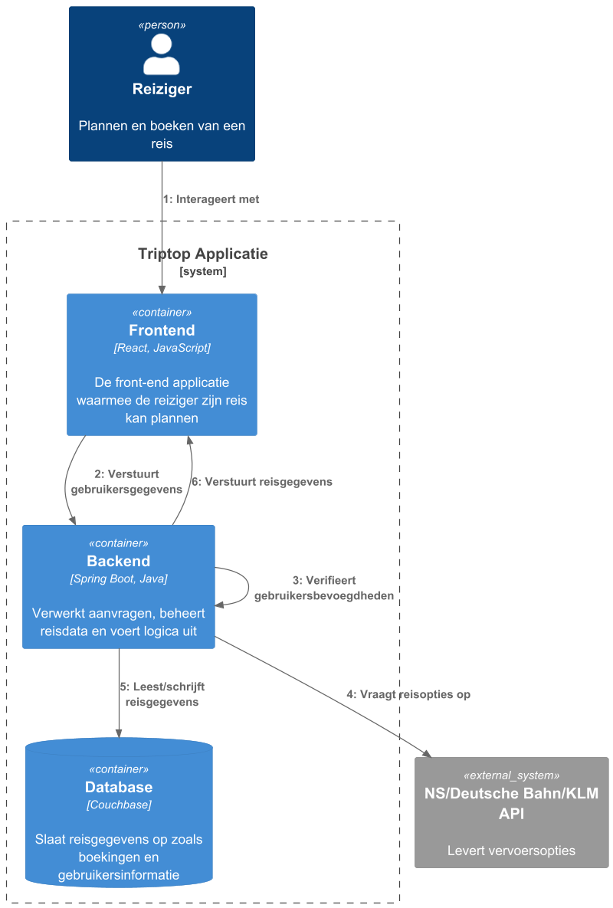
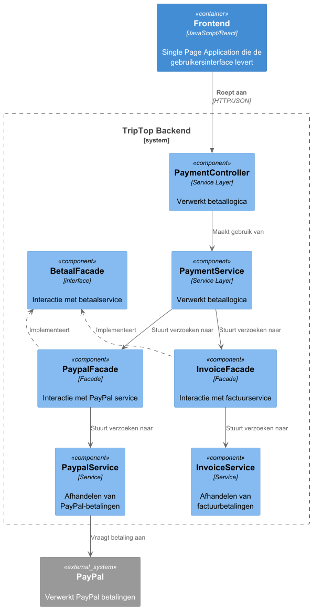
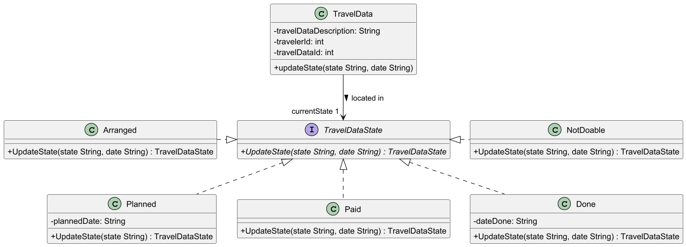
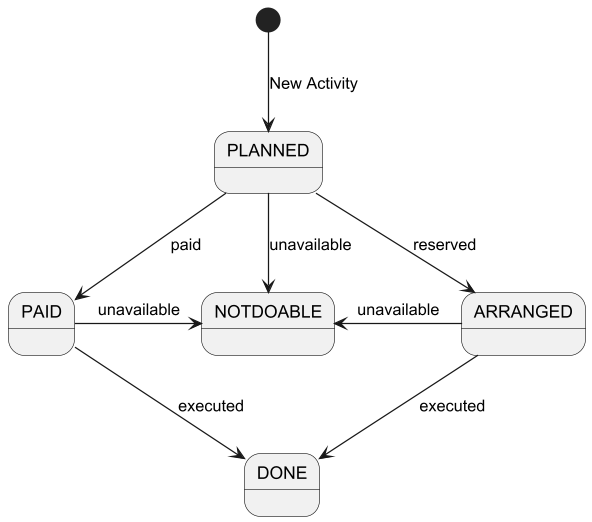

# Software Guidebook Triptop

## 1. Introduction
Dit software guidebook geeft een overzicht van de Triptop-applicatie. Het bevat een samenvatting van het volgende: 
1. De vereisten, beperkingen en principes. 
1. De software-architectuur, met inbegrip van de technologiekeuzes op hoog niveau en de structuur van de software. 
1. De ontwerp- en codebeslissingen die zijn genomen om de software te realiseren.
1. De architectuur van de infrastructuur en hoe de software kan worden geinstalleerd. 

## 2. Context

> Werk zelf dit hoofdstuk uit met context diagrammen en een beschrijving van de context van de software.

Toelichting op de context van de software inclusief System Context Diagram:
* Functionaliteit
* Gebruikers
* Externe systemen

## 3. Functional Overview

Om de belangrijkste features toe te lichten zijn er user stories en twee domain stories gemaakt en een overzicht van het domein in de vorm van een domeinmodel. Op deze plek staat typisch een user story map maar die ontbreekt in dit voorbeeld.

### 3.1 User Stories

#### 3.1.1 User Story 1: Reis plannen

Als gebruiker wil ik een zelfstandig op basis van diverse variabelen (bouwstenen) een reis kunnen plannen op basis van mijn reisvoorkeuren (wel/niet duurzaam reizen, budget/prijsklasse, 's nachts reizen of overdag etc.) zodat ik op vakantie kan gaan zonder dat hiervoor een reisbureau benodigd is.

#### 3.1.2 User Story 2: Reis boeken

Als gebruiker wil ik een geplande reis als geheel of per variabele (bouwsteen) boeken en betalen zodat ik op vakantie kan gaan zonder dat hiervoor een reisbureau benodigd is.

#### 3.1.3 User Story 3: Reis cancelen

Als gebruiker wil ik een geboekte reis, of delen daarvan, kunnen annuleren zodat ik mijn geld terug kan krijgen zonder inmenging van een intermediair zoals een reisbureau.

#### 3.1.4 User Story 4: Reisstatus bewaren 

Als gebruiker wil ik mijn reisstatus kunnen bewaren zonder dat ik een extra account hoef aan te maken zodat ik mijn reis kan volgen zonder dat ik daarvoor extra handelingen moet verrichten.

#### 3.1.5 User Story 5: Bouwstenen flexibel uitbreiden

Als gebruiker wil ik de bouwstenen van mijn reis flexibel kunnen uitbreiden met een zelf te managen stap (bijv. met providers die niet standaard worden aangeboden zoals een andere reisorganisatie, hotelketen etc.) zodat ik mijn reis helemaal kan aanpassen aan mijn wensen.

### 3.2 Domain Story Reis Boeken (AS IS)

### 3.3 Domain Story Reis Boeken (TO BE)

### 3.4 Domain Model

| Class::attribuut                                                                        | Is input voor API+Endpoint | Wordt gevuld door API+Eindpoint | Wordt geleverd door eindgebruiker | Moet worden opgeslagen in de applicatie  |
| --------------------------------------------------------------------------------------- | -------------------------- |---------------------------------| :-------------------------------: |:----------------------------------------:|
| Trip                                                                                                  | JSON Saver (POST)         |                                 |                 x                 |                    x                    |
| TriptopGebruiker::email                                                                 | Easy Authenticator (POST)  |                                 |                 x                 |                    x                     |
| TriptopGebruiker::email                                                                 | Easy Authenticator (POST)  |                                 |                 x                 |                    x                     |
| TriptopGebruiker::email                                                                 | Easy Authenticator (POST)  |                                 |                 x                 |                    x                     |
| TriptopGebruiker::email | Sending an email   /send-email (POST) |                                 | x |                    x                     |
| Email::content | Sending an email   /send-email (POST) | x                               | |                                          |
| Email::subject | Sending an email   /send-email (POST) | x                               | |                                          |

## 4. Quality Attributes

Voordat deze casusomschrijving tot stand kwam, heeft de opdrachtgever de volgende ISO 25010 kwaliteitsattributen benoemd als belangrijk:
* Compatibility -> Interoperability (Degree to which a system, product or component can exchange information with other products and mutually use the information that has been exchanged)
* Reliability -> Fault Tolerance (Degree to which a system or component operates as intended despite the presence of hardware or software faults)
* Maintainability -> Modularity (Degree to which a system or computer program is composed of discrete components such that a change to one component has minimal impact on other components)
* Maintainability -> Modifiability (Degree to which a product or system can be effectively and efficiently modified without introducing defects or degrading existing product quality)
* Security -> Integrity (Degree to which a system, product or component ensures that the state of its system and data are protected from unauthorized modification or deletion either by malicious action or computer error)
* Security -> Confidentiality (Degree to which a system, product or component ensures that data are accessible only to those authorized to have access)

## 5. Constraints

De software wordt opgesteld voor een webapplicatie, en zal dus nog geen rekening houden met een mobiele applicatie of dergelijke. 
Communicatie met externe APIs wordt uitgevoerd door gebruik van JSON.
De frontend zal worden opgesteld door gebruik van Javascript en React. De backend wordt gemaakt door gebruik van Java en Spring Boot.
Deze keuze is gemaakt omdat het projectteam al bekend is met deze talen en frameworks, en er al andere onbekende onderdelen worden gebruikt waarmee het team zich bekend moet maken.

## 6. Principles

> [!IMPORTANT]
> Beschrijf zelf de belangrijkste architecturele en design principes die zijn toegepast in de software.

#### Encapsulate what varies
Binnen de software wordt er regelmatig gebruik gemaakt van verschillende soorten reis data en activiteiten waarmee de gebruikers hun reis kunnen samen stellen. 
Deze stukken reis data kunnen zich binnen het systeem in verschillende toestanden bevinden, met elke toestand ander gedrag en variabele die moeten worden opgeslagen. 
Omdat deze toestanden later nog aangepast of uitgebreid kunnen worden is het volgens het design principe 'Encapsulate What Varies' van belang dat deze toestanden worden opgenomen 
in een geïsoleerde omgeving van de rest van de software door gebruik van een interface die bij alle toestanden geïmplemteerd word.
Verder wordt elke externe datastructuur ingekapseld in een aparte adapter, waardoor wijzigingen in de datastructuur van een externe service geen impact hebben op de rest van het systeem.
De logica van het fetchen en mappen van de externe data is volledig losgekoppeld van de rest van de applicatie.

### Adapter pattern principles
Voor het adapter pattern is er bewust gebruikgemaakt van meerdere design principles om de uitbreidbaarheid, 
flexibiliteit en onderhoudbaarheid van het systeem te waarborgen.

#### Single Responsibility Principle
De verantwoordelijkheden zijn duidelijk verdeeld over de verschillende klassen van de applicatie:

•	De HotelController is enkel verantwoordelijk voor het afhandelen van HTTP-verzoeken. 

•	De HotelService bevat de businesslogica en bepaalt welke API-client wordt aangesproken. 

•	De BookingApiClient fungeert als delegatielaag tussen service en adapter.

•	De ExternalApiHotelAdapter is verantwoordelijk voor het ophalen én mappen van de externe response naar het interne formaat.

Hierdoor blijft de structuur helder en kunnen onderdelen eenvoudig aangepast of getest worden.

#### Program to an Interface
Door te programmeren op een interface (IHotelService) in plaats van op concrete implementaties 
(zoals ExternalApiHotelAdapter), kunnen we gemakkelijk wisselen tussen verschillende externe bronnen of 
testimplementaties zonder dat de rest van de code aangepast hoeft te worden. Dit maakt de architectuur
veel flexibeler en beter uitbreidbaar.

#### Interface Segregation Principle(ISP)
Het Interface Segregation Principle (ISP) is een van de SOLID-principes en stelt dat een interface niet verplicht mag worden om methoden te implementeren die het niet nodig heeft.
Dit zorgt ervoor dat klassen alleen afhankelijk zijn van methoden die ze daadwerkelijk gebruiken.
Door dit toe te passen in de paymentFacade zorg ik ervoor dat je alle betaalServices kunt aanroepen met de betaal() functie.

## 7. Software Architecture

###     7.1. Containers

#### Statisch C4 container diagram:

In bovenstaand diagram zijn alle relevante containers opgenomen voor het opbouwen van de software.
Hierbij staat de verbinding tussen de backend en de verschillende externe APIs voor het ophalen van informatie centraal.

#### Dynamisch C4 diagram 'inloggen':

#### Dynamisch C4 diagram 'reis boeken':

###     7.2. Components

> [!IMPORTANT]
> Voeg toe: Component Diagram plus een Dynamic Diagram van een aantal scenario's inclusief begeleidende tekst.

#### Component Diagram beschermen tegen externe API's

Aan de achterkant zorgt de HotelService ervoor dat de logica wordt afgehandeld. Deze service schakelt de BookingApiClient in, die via de interface IHotelService communiceert met een adapter (ExternalApiHotelAdapter).

De adapter maakt een HTTP-aanroep naar de externe Booking.com API en zet de response om naar een interne representatie (HotelDTO). Deze losgekoppelde structuur voorkomt dat wijzigingen in de externe API impact hebben op de rest van de applicatie.
#### Dynamic Diagram beschermen tegen externe API's

Dit diagram toont de flow van een hotelzoekopdracht in de applicatie.
1.	De gebruiker stuurt een HTTP GET-verzoek naar /hotels.
2.	De HotelController stuurt de parameters door naar de HotelService.
3.	De HotelService schakelt de BookingApiClient in voor communicatie met de adapter.
4.	De BookingApiClient gebruikt de ExternalApiHotelAdapter om een API-aanroep te doen naar Booking.com.
5.	De adapter haalt de externe JSON-response op en zet deze om naar een interne HotelDTO.
6.	De lijst van HotelDTO’s wordt via de lagen teruggestuurd naar de gebruiker als JSON.

#### Component Diagram States

Bovenstaand diagram toont de verschillende componenten die spelen bij het aanpassen en opslaan van een stuk reisdata. 
Hierbij wordt de reisdata eerst opgehaald vanuit de database of vanuit de externe APIs waarmee andere onderdelen van de applicatie in contact staan.

#### Dynamic Diagram States

Bovenstaand diagram toont de manier waarop verschillende componenten met elkaar communiceren om de toestand van een stuk reisdata of activiteit aan te passen. 
Belangrijk aan deze volgorde is dat niet alle states zo maar mogen worden aangepast, wat de reden is voor het updaten van de state binnen de service. 
Hier wordt gecontroleerd welke state de reisdata zich nu in bevindt, wat dus ook bepaald naar welke states die wel of niet mag transitioneren.

###     7.3. Design & Code
Adapter Pattern Sequence Diagram 

Het sequentiediagram toont de volledige flow van een HTTP-aanvraag tot aan de gemapte hoteldata. De HotelController handelt de HTTP GET request af en gebruikt de HotelService voor domeinlogica. Die service schakelt via de BookingApiClient de ExternalApiHotelAdapter in.
De adapter zorgt voor communicatie met de Booking.com API (callExternalApi) en zet de response om naar een bruikbare datastructuur (mapResponse).
De mapping gebeurt binnen de adapter zelf, wat past bij het Single Responsibility Principle en het Adapter Pattern.

Adapter Pattern Class Diagram 

In dit klassendiagram wordt duidelijk hoe het Adapter Pattern is toegepast om externe JSON-data (Booking.com) te integreren in het systeem zonder afhankelijkheid van de externe structuur. De ExternalApiHotelAdapter is verantwoordelijk voor zowel de API-call (callExternalApi) als het omzetten van de externe response naar interne structuur (mapResponse), waarmee de principes van Encapsulation en Separation of Concerns worden gevolgd.
De IHotelService interface zorgt voor loskoppeling, waardoor andere adapters eenvoudig toegevoegd kunnen worden in de toekomst.

Travel data states class diagram. 

In bovenstaand diagram is weergegeven welke classes van belang zijn voor het beheren van de toestand van een stuk reisdata. 
Binnen dit diagram staat het interface 'TravelDataState' centraal met een abstracte methode die in elke toestand klasse word geïmplementeerd. 
Op het moment dat de toestand van een 'TravelData' object is aangepast word daarmee ook de implementatie van de 'updateState' methode aangepast, 
hierdoor veranderd het gedrag van het object waardoor de state design pattern word toegepast.
Op deze manier wordt er ook rekening gehouden met het design principe 'Encapsulate What Varies', zoals besproken in hoofdstuk 6.

Travel Data State Pattern state diagram.

In bovenstaand diagram is weergegeven op welke manier de toestand van een stuk reisdata kan veranderen. 
Er word hierbij vanuit gegaan dat de toestanden 'Arranged' en 'Paid' aan elkaar gelijk staan, omdat niet alle activiteiten altijd vooraf betaald hoeven worden. 
Denk hierbij bijvoorbeeld aan een etentje of iets soortgelijks wat ter plekke betaald word maar wel gereserveerd kan worden.
Zodra een stuk reisdata op 'done' staat kan deze niet meer worden aangepast.

## 8. Architectural Decision Records

# 8.1. ADR-001 Database
## Status
Under discussion
## Context

Voor TripTop, een Reisplanningsapplicatie
in constructie, moeten we een database kiezen
die schaalbaar en flexibel is, gezien de
verschillende bouwstenen en de integratie
met externe services. De database moet in staat zijn om dynamisch gegevens op te slaan,
zoals reisopties en gebruikersinformatie, en deze efficiënt beheren.
De keuze moet ook de integratie van diverse APIs en het omgaan met veranderende datastructuren ondersteunen,
zonder de applicatie ingrijpend aan te passen.

## Considered Options

| Forces | MongoDB | Cassandra | neo4J | Redis | Couchbase | MySQL |
| --- |---| - |-------|-------|-----------|-------|
| snelheid | + | + | +     | +     | +         | 0     |
| leercurve | + | — | —     | +     | +         | ++    |
| functionaliteit | ++ | + | +     | -     | ++        | ++    |
| schaalbaarheid | + | + | +     | +     | 0         | 0     |
| ervaring | 0 | 0 | 0     | —     | —         | ++    |

## Decision

Omdat functionaliteit en leercurve zwaar meewegen, en ervaring,
schaalbaarheid & snelheid minder meeweegt, is bij ons de overweging gekomen tussen MySQL, MongoDB & Couchbase.
De keuze is gevallen op Couchbase, omdat deze de meeste voordelen heeft.
Als we kijken naar de tabel, en alle zwaarwegende plussen en minnen op- en aftellen,
dan komen wij tot de conclusie dat Couchbase het hoogst scoort.

## Consequences

Het gebruiken van Couchbase geeft TripTop de mogelijkheid om flink op te schalen wanneer het bedrijf daar klaar voor is.
Je krijgt documentbased data, waardoor het datamodel enorm flexibel is.
Het wordt dus makkelijk gemaakt om snel data toe te voegen, of bestaande structuren aan te passen wanneer nodig.
Ook is Couchbase makkelijker te leren

# 8.2. ADR-003 design pattern beschermen tegen externe API's
## Status
Accepted
## Context
De applicatie TripTop communiceert met verschillende externe API’s (Booking.com, Sixt, NS, TripAdvisor, etc). Deze API’s hebben allemaal hun eigen datastructuur, die ook nog eens zouden kunnen veranderen. Een wijziging in hun structuur kan direct impact hebben op de werking van TripTop.

Mijn ontwerpvraag is: “Hoe zorg je ervoor dat je bij een wijziging in de datastructuur van een externe service niet de hele applicatie hoeft aan te passen?”

## Considered Options

| Forces            | Adapter | Facade | State | Strategy | Factory | 
|-------------------|---------|--------|-------|----------|---------|
| Onderhoudbaarheid | ++      | ++     | -     | ++       | ++      |
| Testbaarheid      | +       | -      | --    | ++       | -       |
| Flexibiliteit     | ++      | 0      | -     | +        | 0       |

## Decision
Na het evalueren van verschillende design patterns is gekozen voor het Adapter Pattern. Dit biedt de beste balans tussen onderhoudbaarheid, flexibiliteit en testbaarheid, terwijl het eenvoudig maakt om nieuwe externe services toe te voegen zonder de interne logica te verstoren.

## Consequences
Het gebruik van het Adapter Pattern maakt de code flexibel voor toekomstige uitbreidingen en vergemakkelijkt de testbaarheid door het mocken van externe services. Het zorgt ervoor dat de backend-architectuur robuust blijft, zelfs als de externe systemen veranderen of nieuwe systemen moeten worden geïntegreerd.

# 8.3. ADR-003 beschermen tegen externe API's

## Context

In de applicatie TripTop communiceren we met meerdere externe services (zoals autoverhuur, hotels, activiteiten, vervoer en eetopties). Deze services leveren data met eigen, vaak veranderlijke datastructuren. Een wijziging in een response van zo’n externe service kan impact hebben op meerdere onderdelen van de applicatie.

We willen voorkomen dat een wijziging in een externe datastructuur leidt tot wijzigingen in de businesslogica of presentatie-laag van onze applicatie. De oplossing moet:

•	Aanpasbaar zijn bij verandering van een specifieke API

•	De rest van het systeem onaangetast laten

•	De code begrijpelijk en onderhoudbaar houden

## Considered Options

| Criteria | directe parsing van JSON in de services | Externe API Adapter/APiMapper | één centrale ApiGateway |
| --- | --- | --- | --- |
| snelheid (van verwerken data) | ++ | + | +/- |
| schaalbaarheid | ++ | + | — |
| Aanpasbaarheid | — | ++ | - |

## Decision

We kiezen voor het API Adapter pattern.

De keuze is gevallen op het Adapter Pattern.

De adapter pattern was verreweg de beste keuze op basis van het onderzoek wat ik gedaan heb. De andere opties hadden geen directe goede oplossingen voor isolatie van afhankelijkheid, en de aanpasbaarheid was ook minder sterk. Deze criteria wogen het zwaarst voor deze beslissing.

Hiervoor is gekozen omdat de aanpasbaarheid van de applicatie voor ons het belangrijkst is,
omdat we met meerdere externe services werken die allemaal hun eigen datastructuren hebben.
Dit kan leiden tot veel aanpassingen in de applicatie als we dit niet goed aanpakken.

## Consequences

•	Wijzigingen in externe datastructuren vereisen alleen aanpassing in de betreffende client/mapper

•	De rest van de applicatie (services, controller, repository) blijft stabiel

•	We kunnen eenvoudig nieuwe externe APIs integreren door nieuwe client + mapping toe te voegen

•	Door duidelijk onderscheid tussen domeinmodellen en externe modellen, blijft code begrijpelijk en testbaar

# 8.4. ADR-004 API Falen 

## Status
Proposed

## Context

Voor TripTop, een Reisplanningsapplicatie in constructie,
worden verschillende externe APIs aangeroepen voor het ophalen van reisinformatie voor gebruikers. 
Echter komt het wel eens voor dat de externe APIS onbeschikbaar zijn waardoor deze informatie onbeschikbaar is.
Daarom moet er een keuze gemaakt worden in hoe het systeem hierop reageert.

## Considered Options

| Criteria / Forces  | In-Memory Cache | Foutmelding | Couchbase Cache | Redis | 
|--------------------|----------------|-------------|-----------------|-------|
| Snelheid           | +              | ++          | +               | +     |
| Leercurve          | 0              | ++          | 0               | -     | 
| Waardevolle output | +              | --          | ++              | ++    |
| integreerbaar      | +              | ++          | ++              | 0     |

## Decision

Ondanks dat een simpele foutmelding het meeste pluspunten scoort, valt deze optie al snel af omdat de voornaamste eis de waardevolle output is. 
Omdat er gebruikt word gemaakt van CouchBase als database is het gebruik van de cache binnen deze database makkelijk te integreren, en dus de uiteindelijke keuze. 

## Consequences

Door te kiezen voor Couchbase cache:

- Is integratie een minder groot probleem doordat dit in het bestaande ontwerp makkelijk kan worden toegevoegd
- Kan een waardevolle output teruggegeven worden aan gebruikers door zoekresultaten op te slaan

# 8.5. ADR-005 Reisdata toestand

## Status
Accepted

## Context

Voor TripTop, een Reisplanningsapplicatie in constructie,
worden verschillende stukken reisdata opgehaald en opgeslagen voor het organiseren van een of meerdere reisen. 
Deze stukken reisdata bevatten informatie zoals overnachtingen, vervoer, autohuur, excursies, etc. 
Deze reisdata word opgeslagen met gebruik van verschillende toestanden zodat de gebruiker bij kan houden hoe zijn/haar reisplanning verloopt. 
De vraag is hoe deze toestanden het best kunnen worden geïmplementeerd.

## Considered Options

| Criteria / Forces             | State Pattern | Enum | Strategy Pattern | 
|-------------------------------|--------------|------|------------------|
| Staat verschillend gedrag toe | ++           | +    | +                |
|Uitbreidbaar | + | ++   | + |   
| Delegeerd gedrag aan toestand | ++ | --   | 0 | 

Legenda:
- `++` = sterke positieve score
- `+`  = positief
- `0`  = neutraal
- `—`  = negatief
- `-`  = sterk negatief

## Decision

Omdat het gedrag van de opgeslagen reisdata moet veranderen op basis van de toestand,
b.v. reisdata dat al uitgevoerd is moet niet meer kunnen veranderen, 
is het van belang dat elke toestand andere functionaliteit kan beheren. 
Met deze reden is gekozen voor de state pattern. 

## Consequences

Door te kiezen voor de state pattern:

- Is het makkelijk in te zien in welke toestand een stuk reisdata zich bevind 
- Kan reisdata andere methodes beschikbaar hebben op basis van de huidige toestand
- Kunnen er regels toegevoegd worden aan toestanden om het gedrag ook te beperken 

# 8.7. ADR-007 Externe api's met verouderde beveiligingsprotocollen

## Status
Rejected

## Context

Voor Triptop, waarin we te maken hebben met externe APIs die verouderde beveiligingsprotocollen gebruiken, moeten we een strategie bepalen om veilig met deze APIs te interfacen. Deze externe APIs ondersteunen mogelijk geen moderne protocollen zoals OAuth 2.0, TLS 1.2+, of andere best practices voor beveiliging.

De oplossing moet:
- De risico's van onveilige API-interacties minimaliseren
- Integratie met de externe APIs behouden zonder bedrijfsprocessen te verstoren
- Flexibel en schaalbaar

## Considered Options

| Criteria / Forces          | API Gateway met beveiligingslaag | Proxy | VPN/Private Network | 
|----------------------------|----------------------------------|-------|---------------------|
| Beveiliging                | -                                | -     | -                   |
| Implementatiecomplexiteit  | +                                | 0     | -                   |
| Onderhoudbaarheid          | +                                | ++    | -                   |
| Impact op prestaties       | 0                                | 0     | -                   |
| Schaalbaarheid             | ++                               | +     | --                  |

Legenda:
- `++` = sterke positieve score
- `+`  = positief
- `0`  = neutraal
- `—`  = negatief
- `-`  = sterk negatief

## Decision

Omdat alle opties geen veiligheid kunnen garanderen wanneer een externen api veroudere beveiligingsprotocollen gebruikt hebben wij er voor gekozen om hier niet verder mee te gaan werken.

## Consequences

Dit betekend dat wanneer er verouderde api's zijn we deze niet kunnen gebruiken.

# 8.8. ADR-008 Meerdere betaalsystemen

## Status
Accepted

## Context

Voor Triptop, een modulair platform met verschillende bouwstenen, moeten we een flexibel en schaalbaar betalingssysteem integreren. De oplossing moet voldoen aan de volgende eisen:
- Ondersteuning van meerdere betalingsproviders en betaalmethodes
- Modulair en uitbreidbaar ontwerp

## Considered Options

| Criteria / Forces          | Ondersteun meerdere api's | Losse API voor verschillende betaalmethodes | Eigen betaalgateway | 
|----------------------------|---------------------------|---------------------------------------------|---------------------|
| Implementatiecomplexiteit  | +                         | 0                                           | --                  |
| Onderhoudbaarheid          | +                         | ++                                          | --                  |
| Impact op prestaties       | +                         | ++                                          | +                   |
| Schaalbaarheid             | ++                        | ++                                          | -                   |

Legenda:
- `++` = sterke positieve score
- `+`  = positief
- `0`  = neutraal
- `—`  = negatief
- `-`  = sterk negatief

## Decision

Gezien de prioriteit van schaalbaarheid en onderhoudbaarheid, kiezen we voor het implementeren van losse API's voor verschillende betaalmethodes.
Deze oplossing maakt het mogelijk om elke betaalmethode onafhankelijk te implementeren en te beheren, waardoor uitbreiden makkelijk wordt.
Hoewel de initiële implementatie meer werk is, biedt deze oplossing de flexibiliteit om nieuwe betaalmethodes eenvoudig toe te voegen.

## Consequences

Door te kiezen voor losse API's voor verschillende betaalmethodes, moeten we:

- Voor iedere betaalmethode afzonderlijke API-integraties implementeren, wat zorgt voor meer werk tijdens de initiële ontwikkeling.
- Een goede documentatie en duidelijke standaarden opzetten voor het onderhoud van de API's.

## 9. Deployment, Operation and Support

> [!TIP]
> Zelf beschrijven van wat je moet doen om de software te installeren en te kunnen runnen.

# Gebruik Booking API
## Benodigdheden
- Java 21
- Maven 3.9 
- IDE naar keuze
- internetverbinding
- Geldige API keys

## Installatie
1. Clone de repository naar je lokale machine.
2. Voeg jouw API key toe aan de configuratiebestanden.
3. build de applicatie
4. run de applicatie

## Gebruik (endpoints)
- haal hotels op met vaste locatie (Amsterdam)
http://localhost:8080/amsterdam
- haal hotels op met een locatie  en een gekozen hoeveelheid resultaten (afhankelijk van aantal hotels op locatie)
http://localhost:8080/hotels?latitude=GEKOZENLATITUDE&longitude=GEKOZENLONGITUDE&results=GEKOZENRESULTATEN&amount=GEKOZENHOEVEELHEIDRESULTATEN
longitude = longitude
latitude = latitude
amount = aantal hotels uit reactie