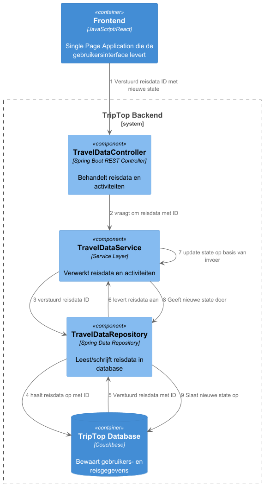

# Software Guidebook Triptop

## 1. Introduction
Dit software guidebook geeft een overzicht van de Triptop-applicatie. Het bevat een samenvatting van het volgende: 
1. De vereisten, beperkingen en principes. 
1. De software-architectuur, met inbegrip van de technologiekeuzes op hoog niveau en de structuur van de software. 
1. De ontwerp- en codebeslissingen die zijn genomen om de software te realiseren.
1. De architectuur van de infrastructuur en hoe de software kan worden geinstalleerd. 

## 2. Context

> Werk zelf dit hoofdstuk uit met context diagrammen en een beschrijving van de context van de software.

Toelichting op de context van de software inclusief System Context Diagram:
* Functionaliteit
* Gebruikers
* Externe systemen

## 3. Functional Overview

Om de belangrijkste features toe te lichten zijn er user stories en twee domain stories gemaakt en een overzicht van het domein in de vorm van een domeinmodel. Op deze plek staat typisch een user story map maar die ontbreekt in dit voorbeeld.

### 3.1 User Stories

#### 3.1.1 User Story 1: Reis plannen

Als gebruiker wil ik een zelfstandig op basis van diverse variabelen (bouwstenen) een reis kunnen plannen op basis van mijn reisvoorkeuren (wel/niet duurzaam reizen, budget/prijsklasse, 's nachts reizen of overdag etc.) zodat ik op vakantie kan gaan zonder dat hiervoor een reisbureau benodigd is.

#### 3.1.2 User Story 2: Reis boeken

Als gebruiker wil ik een geplande reis als geheel of per variabele (bouwsteen) boeken en betalen zodat ik op vakantie kan gaan zonder dat hiervoor een reisbureau benodigd is.

#### 3.1.3 User Story 3: Reis cancelen

Als gebruiker wil ik een geboekte reis, of delen daarvan, kunnen annuleren zodat ik mijn geld terug kan krijgen zonder inmenging van een intermediair zoals een reisbureau.

#### 3.1.4 User Story 4: Reisstatus bewaren 

Als gebruiker wil ik mijn reisstatus kunnen bewaren zonder dat ik een extra account hoef aan te maken zodat ik mijn reis kan volgen zonder dat ik daarvoor extra handelingen moet verrichten.

#### 3.1.5 User Story 5: Bouwstenen flexibel uitbreiden

Als gebruiker wil ik de bouwstenen van mijn reis flexibel kunnen uitbreiden met een zelf te managen stap (bijv. met providers die niet standaard worden aangeboden zoals een andere reisorganisatie, hotelketen etc.) zodat ik mijn reis helemaal kan aanpassen aan mijn wensen.

### 3.2 Domain Story Reis Boeken (AS IS)

### 3.3 Domain Story Reis Boeken (TO BE)

### 3.4 Domain Model

| Class::attribuut                                                                        | Is input voor API+Endpoint | Wordt gevuld door API+Eindpoint | Wordt geleverd door eindgebruiker | Moet worden opgeslagen in de applicatie  |
| --------------------------------------------------------------------------------------- | -------------------------- |---------------------------------| :-------------------------------: |:----------------------------------------:|
| Trip                                                                                                  | JSON Saver (POST)         |                                 |                 x                 |                    x                    |
| TriptopGebruiker::email                                                                 | Easy Authenticator (POST)  |                                 |                 x                 |                    x                     |
| TriptopGebruiker::email                                                                 | Easy Authenticator (POST)  |                                 |                 x                 |                    x                     |
| TriptopGebruiker::email                                                                 | Easy Authenticator (POST)  |                                 |                 x                 |                    x                     |
| TriptopGebruiker::email | Sending an email   /send-email (POST) |                                 | x |                    x                     |
| Email::content | Sending an email   /send-email (POST) | x                               | |                                          |
| Email::subject | Sending an email   /send-email (POST) | x                               | |                                          |

## 4. Quality Attributes

Voordat deze casusomschrijving tot stand kwam, heeft de opdrachtgever de volgende ISO 25010 kwaliteitsattributen benoemd als belangrijk:
* Compatibility -> Interoperability (Degree to which a system, product or component can exchange information with other products and mutually use the information that has been exchanged)
* Reliability -> Fault Tolerance (Degree to which a system or component operates as intended despite the presence of hardware or software faults)
* Maintainability -> Modularity (Degree to which a system or computer program is composed of discrete components such that a change to one component has minimal impact on other components)
* Maintainability -> Modifiability (Degree to which a product or system can be effectively and efficiently modified without introducing defects or degrading existing product quality)
* Security -> Integrity (Degree to which a system, product or component ensures that the state of its system and data are protected from unauthorized modification or deletion either by malicious action or computer error)
* Security -> Confidentiality (Degree to which a system, product or component ensures that data are accessible only to those authorized to have access)

## 5. Constraints

> [!IMPORTANT]
> Beschrijf zelf de beperkingen die op voorhand bekend zijn die invloed hebben op keuzes die wel of niet gemaakt kunnen of mogen worden.

## 6. Principles

> [!IMPORTANT]
> Beschrijf zelf de belangrijkste architecturele en design principes die zijn toegepast in de software.

## 7. Software Architecture

###     7.1. Containers

#### Statisch C4 container diagram:

#### Dynamisch C4 diagram 'inloggen':

#### Dynamisch C4 diagram 'reis boeken':

###     7.2. Components

> [!IMPORTANT]
> Voeg toe: Component Diagram plus een Dynamic Diagram van een aantal scenario's inclusief begeleidende tekst.

###     7.3. Design & Code
Adapter Pattern Dynamic Diagram 

Adapter Pattern Class Diagram 

Travel data State Pattern class diagram. 

## 8. Architectural Decision Records

> Voeg toe: 3 tot 5 ADR's die beslissingen beschrijven die zijn genomen tijdens het ontwerpen en bouwen van de software.

### 8.1. ADR-001 Database
## Status
Under discussion
## Context

Voor TripTop, een Reisplanningsapplicatie
in constructie, moeten we een database kiezen
die schaalbaar en flexibel is, gezien de
verschillende bouwstenen en de integratie
met externe services. De database moet in staat zijn om dynamisch gegevens op te slaan,
zoals reisopties en gebruikersinformatie, en deze efficiënt beheren.
De keuze moet ook de integratie van diverse APIs en het omgaan met veranderende datastructuren ondersteunen,
zonder de applicatie ingrijpend aan te passen.

## Considered Options

| Forces | MongoDB | Cassandra | neo4J | Redis | Couchbase | MySQL |
| --- |---| - |-------|-------|-----------|-------|
| snelheid | + | + | +     | +     | +         | 0     |
| leercurve | + | — | —     | +     | +         | ++    |
| functionaliteit | ++ | + | +     | -     | ++        | ++    |
| schaalbaarheid | + | + | +     | +     | 0         | 0     |
| ervaring | 0 | 0 | 0     | —     | —         | ++    |

## Decision

Omdat functionaliteit en leercurve zwaar meewegen, en ervaring,
schaalbaarheid & snelheid minder meeweegt, is bij ons de overweging gekomen tussen MySQL, MongoDB & Couchbase.
De keuze is gevallen op Couchbase, omdat deze de meeste voordelen heeft.
Als we kijken naar de tabel, en alle zwaarwegende plussen en minnen op- en aftellen,
dan komen wij tot de conclusie dat Couchbase het hoogst scoort.

## Consequences

Het gebruiken van Couchbase geeft TripTop de mogelijkheid om flink op te schalen wanneer het bedrijf daar klaar voor is.
Je krijgt documentbased data, waardoor het datamodel enorm flexibel is.
Het wordt dus makkelijk gemaakt om snel data toe te voegen, of bestaande structuren aan te passen wanneer nodig.
Ook is Couchbase makkelijker te leren

### 8.2. ADR-002 Ontwerpvraag Tren

## Context

In de applicatie **TripTop** communiceren we met meerdere externe services (zoals autoverhuur, hotels, activiteiten, vervoer en eetopties). Deze services leveren data met eigen, vaak veranderlijke datastructuren. Een wijziging in een response van zo’n externe service kan impact hebben op meerdere onderdelen van de applicatie.

We willen voorkomen dat een wijziging in een externe datastructuur leidt tot **wijzigingen in de businesslogica of presentatie-laag** van onze applicatie. De oplossing moet:

•	Aanpasbaar zijn bij verandering van een specifieke API

•	De rest van het systeem onaangetast laten

•	De code begrijpelijk en onderhoudbaar houden

## Considered Options

| Criteria | directe parsing van JSON in de services | Externe API Adapter/APiMapper | één centrale ApiGateway |
| --- | --- | --- | --- |
| snelheid (van verwerken data) | ++ | + | +/- |
| schaalbaarheid | ++ | + | — |
| Aanpasbaarheid | — | ++ | - |

## Decision

In de applicatie TripTop communiceren we met meerdere externe services (zoals autoverhuur, hotels, activiteiten, vervoer en eetopties). Deze services leveren data met eigen, vaak veranderlijke datastructuren. Een wijziging in een response van zo’n externe service kan impact hebben op meerdere onderdelen van de applicatie.

We willen voorkomen dat een wijziging in een externe datastructuur leidt tot wijzigingen in de businesslogica of presentatie-laag van onze applicatie. De oplossing moet:

•	Aanpasbaar zijn bij verandering van een specifieke API

•	De rest van het systeem onaangetast laten

•	De code begrijpelijk en onderhoudbaar houden

## Consequences

•	Wijzigingen in externe datastructuren vereisen alleen aanpassing in de betreffende client/mapper

•	De rest van de applicatie (services, controller, repository) blijft stabiel

•	We kunnen eenvoudig nieuwe externe APIs integreren door nieuwe client + mapping toe te voegen

•	Door duidelijk onderscheid tussen domeinmodellen en externe modellen, blijft code begrijpelijk en testbaar

# 8.3. ADR-003 Design pattern

## Status
Closed
## Context
Het systeem heeft verschillende externe services die via een gemeenschappelijk adapter moeten worden aangesproken. Dit maakt de implementatie van een schaalbare en onderhoudbare oplossing noodzakelijk, waarbij de interne logica niet hoeft te worden aangepast wanneer nieuwe externe services worden toegevoegd.

## Considered Options

| Forces            | Adapter | Facade | State | Strategy | Factory | 
|-------------------|---------|--------|-------|----------|---------|
| Onderhoudbaarheid | ++      | ++     | -     | ++       | ++      |
| Testbaarheid      | +       | -      | --    | ++       | -       |
| Flexibiliteit     | ++      | 0      | -     | +        | 0       |

## Decision
Na het evalueren van verschillende design patterns is gekozen voor het Adapter Pattern. Dit biedt de beste balans tussen onderhoudbaarheid, flexibiliteit en testbaarheid, terwijl het eenvoudig maakt om nieuwe externe services toe te voegen zonder de interne logica te verstoren.

## Consequences
Het gebruik van het Adapter Pattern maakt de code flexibel voor toekomstige uitbreidingen en vergemakkelijkt de testbaarheid door het mocken van externe services. Het zorgt ervoor dat de backend-architectuur robuust blijft, zelfs als de externe systemen veranderen of nieuwe systemen moeten worden geïntegreerd.

### 8.4. ADR-004 API Falen 

## Status
Proposed

## Context

Voor TripTop, een Reisplanningsapplicatie in constructie,
worden verschillende externe APIs aangeroepen voor het ophalen van reisinformatie voor gebruikers. 
Echter komt het wel eens voor dat de externe APIS onbeschikbaar zijn waardoor deze informatie onbeschikbaar is.
Daarom moet er een keuze gemaakt worden in hoe het systeem hierop reageert.

## Considered Options

| Criteria / Forces  | In-Memory Cache | Foutmelding | Couchbase Cache | Redis | 
|--------------------|----------------|-------------|-----------------|-------|
| Snelheid           | +              | ++          | +               | +     |
| Leercurve          | 0              | ++          | 0               | -     | 
| Waardevolle output | +              | --          | ++              | ++    |
| integreerbaar      | +              | ++          | ++              | 0     |

## Decision

Ondanks dat een simpele foutmelding het meeste pluspunten scoort, valt deze optie al snel af omdat de voornaamste eis de waardevolle output is. 
Omdat er gebruikt word gemaakt van CouchBase als database is het gebruik van de cache binnen deze database makkelijk te integreren, en dus de uiteindelijke keuze. 

## Consequences

Door te kiezen voor Couchbase cache:

- Is integratie een minder groot probleem doordat dit in het bestaande ontwerp makkelijk kan worden toegevoegd
- Kan een waardevolle output teruggegeven worden aan gebruikers door zoekresultaten op te slaan

### 8.5. ADR-005 Reisdata toestand

## Status
Proposed

## Context

Voor TripTop, een Reisplanningsapplicatie in constructie,
worden verschillende stukken reisdata opgehaald en opgeslagen voor het organiseren van een of meerdere reisen. 
Deze stukken reisdata bevatten informatie zoals overnachtingen, vervoer, autohuur, excursies, etc. 
Deze reisdata word opgeslagen met gebruik van verschillende toestanden zodat de gebruiker bij kan houden hoe zijn/haar reisplanning verloopt. 
De vraag is hoe deze toestanden het best kunnen worden geïmplementeerd.

## Considered Options

| Criteria / Forces             | State Pattern | Enum | Strategy Pattern | 
|-------------------------------|--------------|------|------------------|
| Staat verschillend gedrag toe | ++           | +    | +                |
|Uitbreidbaar | + | ++   | + |   
| Delegeerd gedrag aan toestand | ++ | --   | 0 | 

Legenda:
- `++` = sterke positieve score
- `+`  = positief
- `0`  = neutraal
- `—`  = negatief
- `-`  = sterk negatief

## Decision

Omdat het gedrag van de opgeslagen reisdata moet veranderen op basis van de toestand,
b.v. reisdata dat al uitgevoerd is moet niet meer kunnen veranderen, 
is het van belang dat elke toestand andere functionaliteit kan beheren. 
Met deze reden is gekozen voor de state pattern. 

## Consequences

Door te kiezen voor de state pattern:

- Is het makkelijk in te zien in welke toestand een stuk reisdata zich bevind 
- Kan reisdata andere methodes beschikbaar hebben op basis van de huidige toestand
- Kunnen er regels toegevoegd worden aan toestanden om het gedrag ook te beperken 

## 8.6. ADR-006  patterns Tren
## Context

In de applicatie TripTop communiceren we met meerdere externe services.
Deze services leveren data met eigen, vaak veranderlijke datastructuren.
Een wijziging in een response van zo’n externe service kan impact hebben op meerdere onderdelen van de applicatie.
We willen voorkomen dat een wijziging in een externe datastructuur leidt tot wijzigingen in de businesslogica of presentatie-laag van onze applicatie.
De oplossing moet:

- Aanpasbaar zijn bij verandering van een specifieke API
- De rest van het systeem onaangetast laten
- De code begrijpelijk en onderhoudbaar houden

## Considered Options

| Criteria               | Adapter Pattern                   | Strategy Pattern                    | Facade Pattern                       |
|------------------------|-----------------------------------|-------------------------------------|--------------------------------------|
| Isoleert externe APIs  | ++                                | –                                   | +                                    |
| Open/Closed Principle  | ++                                | +                                   | –                                    |
| Herbruikbaarheid       | +                                 | ++                                  | –                                    |
| Complexiteit           | +                                 | –                                   | ++                                   |
| Specifiek voor datastructuren | ++                          | –                                   | ±                                    |

## Decision

We kiezen voor het Adapter Pattern.

Het Adapter Pattern zorgt ervoor dat we externe datastructuren kunnen omzetten naar interne domeinmodellen via een specifieke adapter per externe API.
Deze adapter vormt een brug tussen onze interne interface en de werkelijke externe datastructuur.

## Consequences

- Wijzigingen in externe datastructuren vereisen alleen aanpassing in de betreffende adapter
- De rest van de applicatie (services, controllers, repositories) blijft stabiel
- Nieuwe externe APIs zijn eenvoudig te integreren via een nieuwe adapter + interface
- De code blijft testbaar en begrijpelijk door een duidelijk onderscheid tussen externe en interne modellen

## 9. Deployment, Operation and Support

> [!TIP]
> Zelf beschrijven van wat je moet doen om de software te installeren en te kunnen runnen.